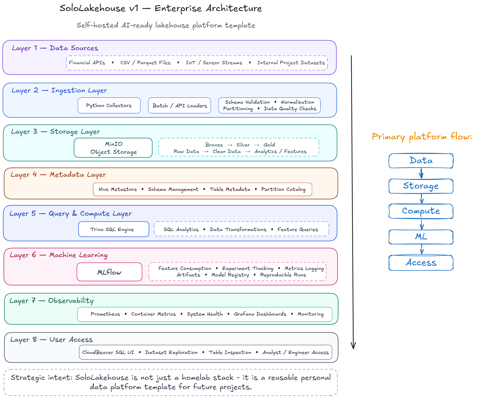

# SoloLakehouse

<p align="center">
  
</p>

<p align="center">
  <i>A production-minded lakehouse platform reference: from runnable core pipelines to orchestrated operations and production-capable platform hardening.</i>
</p>

## What is this?

SoloLakehouse is a **small but complete Lakehouse reference implementation** built from open-source components. It shows how platforms like Databricks or Snowflake are typically layered — object storage, medallion transforms, SQL, ML tracking.

**This is not a framework.** It is a repo you can read, run, and change.

**Current status: [v2.0 (current)](docs/roadmap.md)** — orchestration-first platform upgrade with Dagster assets, schedules, sensors, and checks, while preserving a v1-compatible execution path.

The project now represents:
- **v1 delivered baseline**: five-service lakehouse core (MinIO/PostgreSQL/Hive Metastore/Trino/MLflow)
- **v2 current platform**: Dagster orchestration layer (`dagster-webserver`, `dagster-daemon`) and governance-oriented runtime controls
- **v2.5 reference extension**: Gold table as **Apache Iceberg** in Trino (`iceberg.gold.ecb_dax_features_iceberg`); optional **OpenMetadata** via `make up-openmetadata` ([docs/roadmap.md](docs/roadmap.md), [ADR-013](docs/decisions/ADR-013-iceberg-gold-trino.md), [ADR-014](docs/decisions/ADR-014-openmetadata-optional-profile.md))
- **v3 planned scope**: production-capable platform hardening (Kubernetes/Helm/Terraform, promotion/rollback controls, secrets/access governance, SLO-driven observability, Hive-first governance baseline, ML experiment governance)

**Third-party components** (MinIO, PostgreSQL, Hive Metastore, Trino, MLflow, etc.) keep their own licenses; this repo’s license applies to code and docs here.

## Five-layer core

<p align="center">
  
</p>

| Layer | Role |
|-------|------|
| Sources | ECB API + simulated DAX CSV |
| Ingestion | Python collectors, Pydantic, structlog |
| Storage | MinIO, Parquet (Bronze/Silver); Gold also registered as Iceberg in Trino |
| Query | Trino + Hive Metastore + PostgreSQL |
| ML | MLflow |

**Details:** [docs/architecture.md](docs/architecture.md) · **Medallion:** [docs/medallion-model.md](docs/medallion-model.md)

### Target — v1.0 (delivered)



Eight-layer enterprise-style stack (metadata, observability, user access, etc.): **[docs/roadmap.md](docs/roadmap.md)**.

### Current runtime — v2 orchestration

- Default pipeline path: **Dagster** (`make pipeline`)
- Compatibility path: **legacy script** (`make pipeline-v1` or `make pipeline PIPELINE_MODE=v1`)
- Orchestration UI: `http://localhost:3000`

## Version Narrative

- **v1** answers: can the lakehouse pipeline run end-to-end, be validated, and support a minimal data-to-ML loop?
- **v2** answers: can that pipeline be operated as a platform with asset orchestration, scheduling, checks, and replay?
- **v3** answers: can the platform be hardened with multi-environment deployment, governance, security, observability, and release controls?

In short:

> v1 proves the runnable baseline.  
> v2 adds orchestration and platform runtime semantics.  
> v3 hardens the platform for production-minded operations.

## v3 Direction

v3 is intentionally about **platform productionization**, not feature expansion.

Planned priorities:

- Multi-environment reproducibility with `dev -> staging -> production`
- Promotion gates and rollback readiness
- Managed secrets direction and least-privilege access governance
- SLO-driven metrics, alerting, dashboards, and incident runbooks
- Hive-first governance contracts for key Gold and critical Silver datasets
- Stronger ML experiment lineage and reproducibility without requiring full serving

Not default v3 goals:

- Kafka / Flink-style platform expansion
- Full online serving platform
- Superset / FastAPI as primary v3 deliverables
- Mandatory enterprise catalog migration (this repo adds **optional** OpenMetadata for v2.5; v3 still does not require it)
- Major self-serve UX overhaul

## Quick start

**Needs:** Docker + Compose, Python 3.11+, `make`.

```bash
git clone <repository-url>
cd SoloLakehouse
python3 -m venv .venv && source .venv/bin/activate
pip install -r requirements.txt
make setup
```

If `.venv/bin/python` exists, `make` commands automatically use it instead of the system `python3`.

- MinIO Console: http://localhost:9001  
- Trino: http://localhost:8080  
- MLflow: http://localhost:5000  
- Dagster: http://localhost:3000
- OpenMetadata (optional): `make up-openmetadata` then http://localhost:8585

`make up` now waits for all services to become healthy before returning.

```bash
make verify
make pipeline
```

Optional OpenMetadata health check:

```bash
make verify-openmetadata
```

Compatibility run (v1-style):

```bash
make pipeline-v1
# or
make pipeline PIPELINE_MODE=v1
```

Full walkthrough: **[docs/quickstart.md](docs/quickstart.md)** · Deploy prerequisites and troubleshooting: **[docs/deployment.md](docs/deployment.md)** · Release steps: **[docs/release.md](docs/release.md)**

## Quick Validation

After `make up`, run:

```bash
make verify
```

Expected output format:

```text
Service          Status  Detail
---------------- ------- ----------------------------
MinIO            PASS    Buckets: sololakehouse, mlflow-artifacts
PostgreSQL       PASS    Databases: hive_metastore, mlflow, dagster_storage
Hive Metastore   PASS    TCP port 9083 open
Trino            PASS    Running, not starting
MLflow           PASS    HTTP 200
Dagster          PASS    HTTP 200 /server_info
```

If you started the optional metadata stack with `make up-openmetadata`, you can also validate it with `make verify-openmetadata`.

## Common Issues

See troubleshooting guidance in [docs/deployment.md#troubleshooting](docs/deployment.md#troubleshooting).

## Design decisions (ADRs)

| ADR | Topic |
|-----|--------|
| [ADR-001](docs/decisions/ADR-001-docker-compose.md) | Docker Compose vs Kubernetes |
| [ADR-002](docs/decisions/ADR-002-trino-vs-duckdb.md) | Trino vs DuckDB |
| [ADR-003](docs/decisions/ADR-003-parquet-vs-delta.md) | Parquet vs Delta Lake |
| [ADR-004](docs/decisions/ADR-004-financial-dataset.md) | ECB + DAX data |
| [ADR-005](docs/decisions/ADR-005-v1-scope.md) | Observability / SQL UI deferred until after the five-service core |
| [ADR-006](docs/decisions/ADR-006-v2-dagster-orchestration.md) | v2 Dagster orchestration with legacy fallback |
| [ADR-013](docs/decisions/ADR-013-iceberg-gold-trino.md) | Iceberg for Gold via Trino |
| [ADR-014](docs/decisions/ADR-014-openmetadata-optional-profile.md) | OpenMetadata optional Compose profile |
| [ADR index](docs/decisions/README.md) | Full ADR set (v1–v2.5 delivered; v3 planned) |

## Documentation index

| Doc | Content |
|-----|---------|
| [docs/USER_GUIDE_EN.md](docs/USER_GUIDE_EN.md) | **Complete user guide (English)** — install, v1/v2 walkthrough, all UIs, v3 preview, troubleshooting |
| [docs/USER_GUIDE.md](docs/USER_GUIDE.md) | **完整用户指导书（中文）** — 安装、v1/v2 全流程、所有 UI、v3 规划、排障 |
| [docs/README.md](docs/README.md) | All docs |
| [docs/roadmap.md](docs/roadmap.md) | v1.0 target and later versions |
| [docs/v1-to-v2-transition.md](docs/v1-to-v2-transition.md) | v1 delivered baseline, v2 current scope, migration narrative |
| [docs/EVOLVING_PLAN.md](docs/EVOLVING_PLAN.md) | Detailed implementation tasks |
| [docs/governance-v3-matrix.md](docs/governance-v3-matrix.md) | v3 governance capability matrix |
| [docs/v3-governance-navigation.md](docs/v3-governance-navigation.md) | One-page navigation for v3 governance docs |
| [tutorial_v1/README.md](tutorial_v1/README.md) | Chinese deep-dive tutorial for the v1 baseline |
| [tutorial_v2/README.md](tutorial_v2/README.md) | Chinese v2 / Dagster interview-oriented tutorial |
| [TASKS.md](TASKS.md) | Backlog and ideas |

## Repository layout

```
SoloLakehouse/
├── config/           # Trino, PostgreSQL, MinIO, …
├── docker/           # Compose + Dockerfiles
├── docs/             # Architecture, ADRs, deployment, roadmap
├── ingestion/        # Collectors, schemas, Bronze writes
├── transformations/  # Bronze → Silver → Gold
├── ml/               # Training and evaluation
├── scripts/          # Pipeline and verification
├── tests/
├── data/sample/      # Sample DAX CSV (demo)
├── TASKS.md
├── README.md
└── CLAUDE.md         # Agent / contributor quick reference
```

## Contributing

See **[docs/contributing.md](docs/contributing.md)** (or [CONTRIBUTING.md](CONTRIBUTING.md) in the root).

## License

MIT
