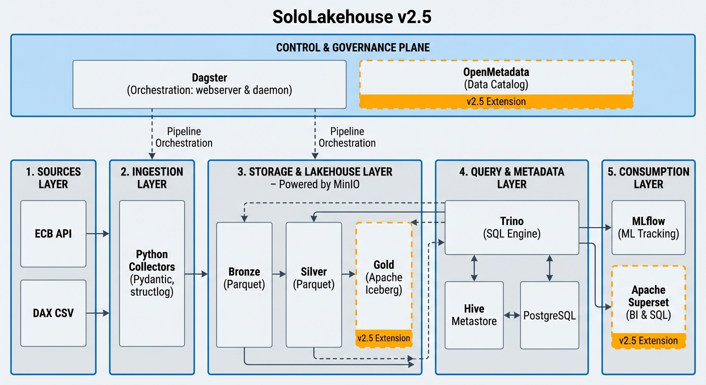

# SoloLakehouse

<p align="center">
  
</p>

<h3 align="center">A local-first lakehouse reference architecture for production-minded data platform engineering.</h3>

<p align="center">
  Run a governed medallion data platform locally with MinIO, Trino, Iceberg, Dagster, MLflow, OpenMetadata, and Superset.
</p>

<p align="center">
  <a href="https://github.com/Jiahong-Que-9527/SoloLakehouse/actions/workflows/test.yml"></a>
  
  
  
  
  
  
  
</p>

<p align="center">
  <a href="#quick-start"><strong>Run locally</strong></a>
  ·
  <a href="docs/architecture.md"><strong>Read architecture</strong></a>
  ·
  <a href="docs/decisions/README.md"><strong>Review ADRs</strong></a>
  ·
  <a href="docs/ASSESSMENT_LAKEHOUSE_DAX_ECB.md"><strong>Challenge the design</strong></a>
</p>

---

## Platform Snapshot

SoloLakehouse is a readable, runnable, cloud-neutral lakehouse reference architecture. It is designed to show how modern data platform building blocks fit together without hiding the operating model behind a managed SaaS layer.

It is not a framework and not a library. It is a production-minded reference implementation you can run locally, inspect end to end, fork, critique, and extend.

<p align="center">
  
</p>

<p align="center">
  <em>v2.5 reference architecture: local-first lakehouse with orchestration, governance, BI, ML tracking, and Iceberg Gold tables.</em>
</p>

## Why SoloLakehouse Exists

Enterprise data platforms are often explained through vendor products: Databricks, Snowflake, managed Airflow, managed catalogs, managed object storage, managed everything. SoloLakehouse takes the opposite route. It exposes the core platform mechanics on one local runtime so the architecture is understandable, portable, and owned by the engineer running it.

The project exists to demonstrate:

| Principle | What it means in SoloLakehouse |
|-----------|--------------------------------|
| **Cloud independence** | The platform runs locally with open-source components and avoids requiring a managed cloud lakehouse service. |
| **Compliance awareness** | Data boundaries, service responsibilities, metadata, release checks, and architecture decisions are explicit rather than implied. |
| **Portability** | Storage, orchestration, catalog, BI, and deployment layers have documented migration paths. |
| **Platform engineering capability** | The project demonstrates orchestration, data quality, metadata, ML tracking, BI access, CI, ADRs, release discipline, and roadmap ownership. |
| **Readable architecture** | The stack is intentionally small enough to inspect but complete enough to discuss production trade-offs. |

## Who It Is For

| Audience | Why it matters |
|----------|----------------|
| **Recruiters and hiring managers** | A compact signal of senior data/platform engineering judgment: system design, governance posture, documentation, and operational maturity. |
| **Data platform engineers** | A hands-on reference for lakehouse components, medallion modeling, orchestration, cataloging, BI, and ML experiment tracking. |
| **Analytics and ML engineers** | A local path from raw data ingestion through Bronze, Silver, Gold, SQL access, dashboards, and MLflow experiments. |
| **Enterprise architects** | A concrete architecture for discussing cloud neutrality, compliance boundaries, service ownership, and migration trade-offs. |

## Enterprise Use Cases

SoloLakehouse is intentionally shaped around enterprise platform concerns, not only local experimentation.

| Use case | What the project demonstrates |
|----------|-------------------------------|
| **Regulated-data analytics sandbox** | Local-first lakehouse execution with explicit data storage, metadata, and service boundaries. |
| **Cloud-neutral lakehouse prototype** | Open components that map to managed cloud equivalents without requiring them. |
| **Lakehouse migration rehearsal** | A small but complete environment for testing medallion patterns, table formats, query engines, and orchestration choices. |
| **Governance and catalog demo** | OpenMetadata integration for catalog visibility and platform discovery workflows. |
| **BI and ML reference stack** | Superset and MLflow provide dashboard and experiment-tracking surfaces on top of the same lakehouse foundation. |
| **Senior engineering portfolio asset** | ADRs, roadmap, release checks, and architecture evolution show long-term platform ownership. |

## Quick Start

Requirements: Docker with the Compose plugin, Python 3.13+, and `make`.

```bash
git clone https://github.com/Jiahong-Que-9527/SoloLakehouse.git
cd SoloLakehouse
python3 -m venv .venv && source .venv/bin/activate
pip install -r requirements.txt
make setup
```

Run the platform checks and execute the end-to-end pipeline:

```bash
make verify
make pipeline
```

Default service URLs:

| Service | URL |
|---------|-----|
| Dagster | `http://localhost:3000` |
| Superset | `http://localhost:8088` |
| OpenMetadata | `http://localhost:8585` |
| MLflow | `http://localhost:5000` |
| Trino | `http://localhost:8080` |
| MinIO Console | `http://localhost:9001` |

Full deployment notes, host sizing, credentials, cleanup behavior, and troubleshooting are documented in [docs/deployment.md](docs/deployment.md). The fast path is documented in [docs/quickstart.md](docs/quickstart.md).

## Platform Demo

Screenshots are intentionally reserved as placeholders until the next visual pass. Add final images under `docs/img/readme/` when available.

| Surface | Visual placeholder | What to show |
|---------|--------------------|--------------|
| **Dagster orchestration** | `docs/img/readme/dagster.png` | Asset graph, successful `full_pipeline_job`, schedules, and sensors. |
| **Superset dashboard** | `docs/img/readme/superset.png` | Gold-layer analytics dashboard backed by Trino. |
| **OpenMetadata catalog** | `docs/img/readme/openmetadata.png` | Cataloged tables, schemas, lineage, and ownership metadata. |
| **MLflow experiments** | `docs/img/readme/mlflow.png` | Experiment runs, metrics, parameters, and artifacts. |
| **Trino SQL** | `docs/img/readme/trino.png` | Query execution over Hive and Iceberg catalogs. |
| **MinIO storage** | `docs/img/readme/minio.png` | Bronze, Silver, Gold, and MLflow artifact layout. |

## Architecture At A Glance

The active runtime is **v2.5 only**. Historical v1/v2 parallel execution paths are archived under [docs/history/](docs/history/).

| Platform capability | Component | Why it matters |
|---------------------|-----------|----------------|
| Object storage | MinIO | S3-compatible local storage for data and ML artifacts. |
| Metadata database | PostgreSQL | Durable backend for Hive Metastore, MLflow, and Dagster storage. |
| Metastore | Hive Metastore | Shared table metadata for Trino catalogs. |
| Table format | Apache Iceberg | Open table format for Gold-layer tables through Trino. |
| Query engine | Trino | SQL access across Hive and Iceberg catalogs. |
| Orchestration | Dagster | Asset graph, jobs, schedules, sensors, and checks. |
| ML tracking | MLflow | Experiments, metrics, parameters, and artifacts. |
| Data catalog | OpenMetadata | Metadata discovery and governance foundation. |
| BI and SQL UI | Superset | Dashboarding and interactive SQL exploration. |

### Medallion Flow

```text
Data sources
  -> Bronze: raw immutable data with ingestion metadata
  -> Silver: typed, cleaned, deduplicated analytical datasets
  -> Gold: ML-ready feature tables registered through Iceberg
  -> BI / ML: Superset dashboards and MLflow experiments
```

Current demo sources include ECB SDW API data and DAX sample data. The detailed data model is documented in [docs/medallion-model.md](docs/medallion-model.md).

## Architecture Evolution

SoloLakehouse is maintained as an evolving platform architecture, not a one-off stack diagram.

| Version | Status | Platform story |
|---------|--------|----------------|
| **v1.0** | Delivered, historical | Runnable local medallion lakehouse foundation. |
| **v2.0** | Delivered, historical | Dagster orchestration introduced and validated. |
| **v2.5** | Current baseline | Single runtime path with Iceberg Gold, OpenMetadata, Superset, and Dagster-first execution. |
| **v3.0** | Planned | Kubernetes, Helm, Terraform, secrets governance, access controls, SLOs, and production promotion patterns. |
| **v4.0** | Planned | Self-serve usability, operational clarity, and polished platform workflows. |

See [docs/roadmap.md](docs/roadmap.md) and [docs/history/architecture-evolution.md](docs/history/architecture-evolution.md) for the complete evolution record.

## Migration Pathways

The project is intentionally built around replaceable platform boundaries. The current stack is local-first, but the architecture is meant to support component migration discussions.

| Current component | Migration direction | Strategic reason |
|-------------------|---------------------|------------------|
| MinIO | SeaweedFS, Ceph, or cloud object storage | Storage portability and cloud-neutral data layout. |
| Docker Compose | Kubernetes, Helm, Terraform | Production deployment model and environment promotion. |
| Local PostgreSQL | Managed PostgreSQL or HA PostgreSQL | Durable metadata and operational reliability. |
| Hive Metastore | REST catalog or managed catalog patterns | Table metadata modernization. |
| Trino | Managed Trino, Starburst, Spark, or Flink query paths | Compute flexibility without rewriting storage layout. |
| Superset | Preset, Tableau, Power BI, or custom BI | BI interface flexibility over the same semantic foundation. |
| OpenMetadata | DataHub, Amundsen, or enterprise catalog tooling | Catalog strategy flexibility. |
| Local secrets | Vault or cloud secret managers | Governance hardening and auditability. |

Relevant ADRs include [ADR-001](docs/decisions/ADR-001-docker-compose.md), [ADR-002](docs/decisions/ADR-002-trino-vs-duckdb.md), [ADR-007](docs/decisions/ADR-007-v3-k8s-helm-terraform.md), [ADR-009](docs/decisions/ADR-009-v3-secrets-and-access-governance.md), [ADR-012](docs/decisions/ADR-012-v3-data-governance-catalog-strategy.md), [ADR-013](docs/decisions/ADR-013-iceberg-gold-trino.md), and [ADR-016](docs/decisions/ADR-016-compute-engine-migration.md).

## Governance And Compliance Posture

SoloLakehouse is best described as **compliance-aware**, not production-certified. It is structured to make enterprise governance conversations concrete:

- Local-first execution keeps data, metadata, logs, and artifacts inspectable on the developer machine.
- ADRs document major architecture trade-offs instead of leaving decisions implicit.
- The medallion model separates raw, cleaned, and feature-ready data responsibilities.
- OpenMetadata establishes a catalog baseline for discovery and governance workflows.
- CI runs linting, type checks, unit tests, and coverage checks on push and pull request.
- Release and demo runbooks document validation steps and operational expectations.
- v3 planning covers secrets, access governance, SLO-driven observability, promotion, and rollback.

The project also includes a candid [self-assessment](docs/ASSESSMENT_LAKEHOUSE_DAX_ECB.md) that documents current trade-offs and known limitations.

## Common Commands

```bash
make up
make verify
make pipeline
make down
make clean
make test
make lint
make typecheck
```

CI runs `ruff`, `mypy`, unit `pytest`, and a coverage floor through [GitHub Actions](.github/workflows/test.yml). Integration tests require the Docker stack and can be run with:

```bash
make test-integration
make release-check
```

Runtime state is stored under `docker/data/` through bind mounts. Use `make down` to stop the stack while keeping data, and `make clean` only when you intentionally want to delete local runtime state.

## Explore The Platform

| Area | Link |
|------|------|
| Architecture | [docs/architecture.md](docs/architecture.md) |
| Quick start | [docs/quickstart.md](docs/quickstart.md) |
| Deployment | [docs/deployment.md](docs/deployment.md) |
| Roadmap | [docs/roadmap.md](docs/roadmap.md) |
| ADR index | [docs/decisions/README.md](docs/decisions/README.md) |
| Demo runbook | [docs/DEMO_RUNBOOK_EN.md](docs/DEMO_RUNBOOK_EN.md) |
| User guide | [docs/USER_GUIDE_EN.md](docs/USER_GUIDE_EN.md) |
| Self-assessment | [docs/ASSESSMENT_LAKEHOUSE_DAX_ECB.md](docs/ASSESSMENT_LAKEHOUSE_DAX_ECB.md) |

## Personal Platform Notes

Add external writing and professional channels here when ready:

| Channel | Placeholder |
|---------|-------------|
| Architecture blog | `TODO` |
| LinkedIn | `TODO` |
| Portfolio | `TODO` |
| Deep-dive article series | `TODO` |

## Support And Feedback

If this architecture is useful, star the repo so more platform engineers can find it.

Architecture critiques are especially welcome:

- Which component boundary would you migrate first?
- Where should governance hardening go deeper?
- What would make this more credible as a production lakehouse reference?
- Which v3 platform capability should be prioritized next?

## License

[MIT](LICENSE)
