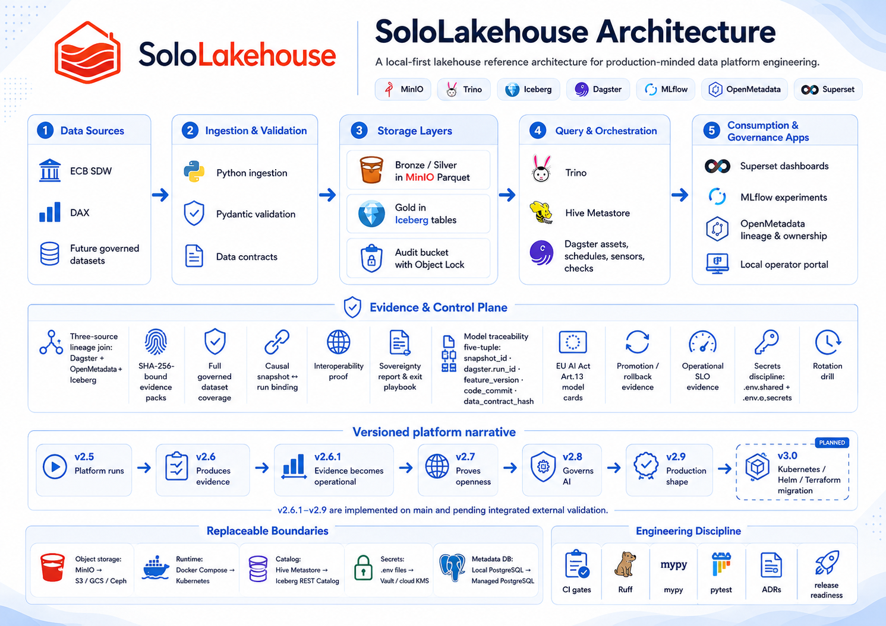

# SoloLakehouse

**A self-hosted reference Data & AI platform for governed, reproducible workflows.**

[](https://github.com/Jiahong-Que-9527/SoloLakehouse/actions/workflows/test.yml) · [Architecture](docs/architecture.md) · [Demo runbook](docs/DEMO_RUNBOOK_EN.md) · [ADRs](docs/decisions/README.md) · [Roadmap](docs/roadmap.md)

SoloLakehouse connects ingestion, Iceberg tables, orchestration, SQL analytics, ML tracking, and metadata in one Docker Compose runtime. The point is not the number of services: it is whether a data product can be **re-run, inspected, and explained** from source through Gold table and model evidence.

The current reference domain is **European financial-market data**: ECB rates and FX, plus EWG (a German-equity proxy) via Alpha Vantage. The architecture is intended to be transferable; this repository does **not** currently run an air-cargo data pipeline.

## What the repository demonstrates

| Platform concern | Inspectable implementation |
|---|---|
| **A reproducible data path** | Python/Pydantic ingestion → Iceberg Bronze, Silver, and Gold on MinIO → Dagster assets and schedules → Trino queries. The finance path includes a freshness check and an EUR market-day Gold table. |
| **Governance tied to execution** | Versioned [dataset contracts](governance/datasets/), quality checks, and [lineage evidence](docs/governance-evidence-layout.md) binding Dagster runs, Iceberg snapshots, and metadata. |
| **ML and operational evidence** | MLflow experiments, model/evaluation artifacts, promotion and rollback drills, and operational evidence commands. [Tests and CI](.github/workflows/test.yml) cover the platform code. |

<p align="center">
  
</p>

**Stack:** Docker Compose · MinIO · Apache Iceberg · Trino · Dagster · PostgreSQL · MLflow · OpenMetadata · Superset. See the [architecture document](docs/architecture.md) for service boundaries and [decision records](docs/decisions/README.md) for trade-offs.

## Run the reference flow

Use Linux, macOS, or Windows **WSL2** with Docker Compose, Python 3.13+, Git, and `make`. The full local stack needs roughly 8 GB free RAM (12 GB recommended); see [quick start](docs/quickstart.md) for details.

```bash
git clone https://github.com/Jiahong-Que-9527/SoloLakehouse.git
cd SoloLakehouse
make setup
make verify
make demo
```

`make setup` creates local environment files from the committed templates and starts the Compose services. For the live EWG source, add an Alpha Vantage key to the gitignored `.env.secrets`; CI uses committed API fixtures. Do not commit credentials. `make demo` checks the Dagster-to-Iceberg-to-Trino path. See [DEMO.md](DEMO.md) and the [operator runbook](RUNBOOK.md) for expected results and troubleshooting.

## Maturity and boundaries

- **Running baseline:** v2.5 on Docker Compose. Governance and operational evidence capabilities through v2.9 are implemented on `main`; the latest published release tag is **v2.6.1**. “On `main`” does not mean a tagged release.
- **Current source path:** live ECB and EWG batch ingestion; the old in-repository DAX sample CSV was retired. Optional crypto streaming is deferred.
- **Not claimed:** enterprise production operation, regulatory certification, enforced AI policy, or a Kubernetes deployment. Kubernetes/Helm/Terraform are planned for v3.0; the current repository includes a readiness check, not that runtime.

The canonical [roadmap](docs/roadmap.md) and [active backlog](TASKS.md) separate delivered work from future scope. For a deeper review, start with the [architecture](docs/architecture.md), [governance evidence layout](docs/governance-evidence-layout.md), [operational SLO](docs/operational-slo.md), and [ADR index](docs/decisions/README.md).

## License

[MIT](LICENSE)
