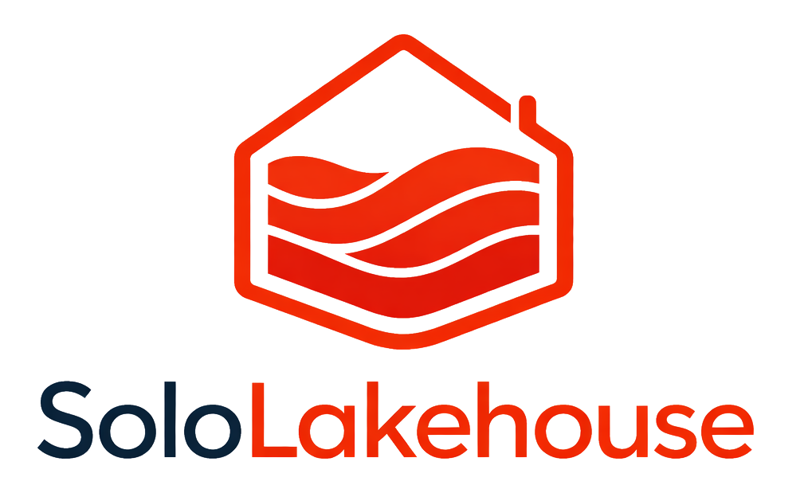
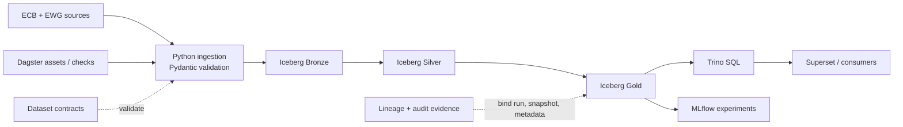

<p align="center"></p>

<h1 align="center">SoloLakehouse</h1>

<p align="center"><strong>A self-hosted Data &amp; AI platform reference for governed, reproducible workflows</strong></p>

[Quick start](docs/quickstart.md) · [Architecture](docs/architecture.md) · [ADRs](docs/decisions/README.md) · [Roadmap](docs/roadmap.md) · [CI runs](https://github.com/Jiahong-Que-9527/SoloLakehouse/actions/workflows/test.yml)

Most lakehouse demos stop when a query returns rows. SoloLakehouse asks the next questions: **Which source and contract produced this table? Which run and snapshot support a result? Can an operator reproduce the flow, inspect a failure, and explain a model artifact?**

This repository implements a local, single-host reference platform rather than an enterprise production service. It connects ingestion, orchestration, all-layer Iceberg storage, SQL analytics, ML tracking, metadata, and evidence generation in a Docker Compose runtime.

## At a glance

| | Current implementation |
|---|---|
| **Reference workload** | European financial-market data: ECB policy rates and FX, plus EWG (a German-equity proxy) from Alpha Vantage. The legacy in-repo DAX sample CSV is retired. |
| **Data path** | Python/Pydantic collectors → Iceberg Bronze / Silver / Gold on MinIO → Dagster assets and checks → Trino queries, with Superset, MLflow, and OpenMetadata alongside. |
| **Evidence path** | Dataset contracts and quality rules; Dagster-run, Iceberg-snapshot, and metadata lineage joins; ML lineage; operational and promotion evidence. |
| **Delivery status** | v2.5 Compose architecture baseline; governance/control-plane work through v2.9 is on `main`. The latest published tag is v2.6.1. Kubernetes deployment is planned, not delivered. |

The finance workload tests platform patterns that can transfer to other regulated or operational domains. **This repository does not currently ingest air-cargo data** and should not be presented as a deployed aviation platform.

## Architecture: data flow and evidence flow


```mermaid
flowchart LR
    S["ECB + EWG sources"] --> I["Python ingestion<br/>Pydantic validation"]
    I --> B["Iceberg Bronze"] --> V["Iceberg Silver"] --> G["Iceberg Gold"]
    D["Dagster assets / checks"] --> I
    G --> T["Trino SQL"] --> U["Superset / consumers"]
    G --> M["MLflow experiments"]
    C["Dataset contracts"] -.->|validate| I
    E["Lineage + audit evidence"] -.->|bind run, snapshot, metadata| G
```

The runtime also includes MinIO object storage, PostgreSQL/Hive Metastore, OpenMetadata, and a local operator portal. The [architecture document](docs/architecture.md) describes the services and their boundaries; [ADR-020](docs/decisions/ADR-020-iceberg-all-layers.md) records the all-layer Iceberg decision.

## What to inspect

| Engineering question | Repository evidence |
|---|---|
| **How is the data flow verified?** | `make setup`, `make verify`, and `make demo` are the intended local path to start the stack and check Gold through Trino. The [demo runbook](docs/DEMO_RUNBOOK_EN.md) states what to observe and how to troubleshoot it; see the current CI limitation below. |
| **Is data quality explicit?** | [Versioned dataset contracts](governance/datasets/) and validation/quality checks cover the finance pipeline, including freshness and the [EUR market-day Gold contract](governance/datasets/fin.eur_market_daily_gold.yaml). |
| **Can a result be traced?** | The [governance evidence layout](docs/governance-evidence-layout.md) and [ML lineage decision](docs/decisions/ADR-018-ml-lineage-five-tuple.md) document how runs, table snapshots, contracts, and model artifacts are related. |
| **What happens during operation or change?** | [Operational SLO evidence](docs/operational-slo.md), [promotion/rollback decisions](docs/decisions/ADR-022-v29-promotion-operational-evidence.md), and the [secrets/Kubernetes-readiness decision](docs/decisions/ADR-023-v29-secrets-k8s-readiness.md) make trade-offs and limits reviewable. |

These are **reference implementations and internal evidence mechanisms**. They do not imply a regulatory certification, a customer deployment, or an externally guaranteed SLA.

## Run the reference flow

Use Linux, macOS, or Windows **WSL2** with Docker Compose, Python 3.13+, Git, and `make`. Allow at least 8 GB free RAM for the full stack (12 GB recommended).

```bash
git clone https://github.com/Jiahong-Que-9527/SoloLakehouse.git
cd SoloLakehouse
make setup
make verify
make demo
```

`make setup` is designed to create local environment files from committed templates, install dependencies, and start the Compose services. For the live EWG market source, put an Alpha Vantage key in the gitignored `.env.secrets`; CI uses committed API fixtures. Never commit credentials. See the [quick-start guide](docs/quickstart.md), [demo walkthrough](DEMO.md), and [operator runbook](RUNBOOK.md) for configuration, expected results, and failure handling.

## Current boundary and next step

- **Implemented now:** the v2.5 Compose architecture and governance, ML, catalog, and operational-evidence capabilities on `main` through v2.9. The published `v2.6.1` tag predates some of that `main` work.
- **Known verification gap:** the [2026-09-28 GitHub `compose-demo` run](https://github.com/Jiahong-Que-9527/SoloLakehouse/actions/runs/36444030708/job/109003572805) failed before stack startup because the runner could not pull `minio/minio`. Lint, typecheck, and unit tests passed in that run; a clean Compose demo needs to be revalidated after the image-source issue is resolved.
- **Current work:** operate and harden the batch finance path; optional crypto streaming is deferred. The [active backlog](TASKS.md) and [roadmap](docs/roadmap.md) are authoritative for status.
- **Not yet delivered:** Kubernetes/Helm/Terraform runtime migration, multi-environment production operation, AI policy enforcement, and an air-cargo pipeline in this repository.

The design principle is to make claims **testable and inspectable before expanding the runtime**. Feedback on the architecture, evidence boundaries, and operational trade-offs is welcome.

## License

[MIT](LICENSE)
