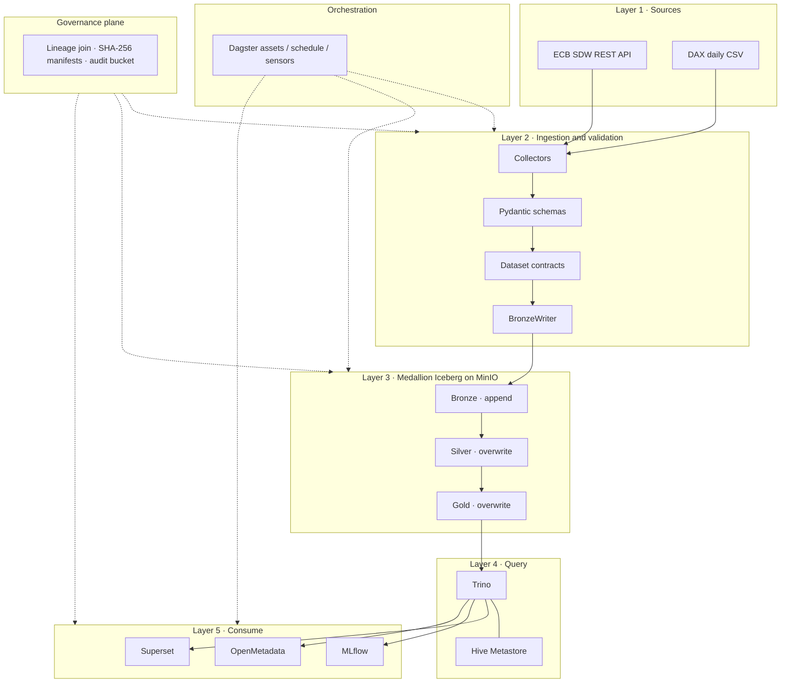
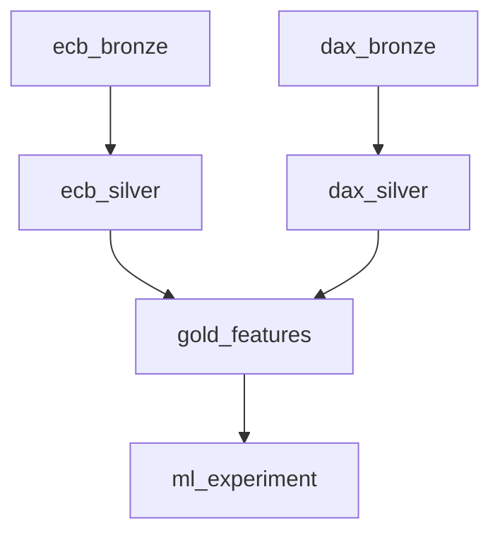

# SoloLakehouse Active Backlog

This file is the **single active backlog** for the shared SoloLakehouse
codebase.

Use it to answer:

- what the repository should build next
- which version is currently active
- what future agents must treat as in-scope or out-of-scope
- how v2.6 -> v3.0 work is sequenced

`docs/roadmap.md` defines the strategic direction.
`TASKS.md` defines the execution order and active backlog.

## Canonical Planning State

As of `2026-08-15`:

- `v2.5` is delivered and protected from regression.
- `v2.6.1` tag (`6bd138a`, `2026-07-31`) is **released** and carries the corrected
  version stamp. `v2.6.0` is superseded. The tag does **not** include Block `J`.
- Block `J` is **implemented and internally verified on `main`** (`e534c73`,
  PR #49).
- **v2.8 Block `E` is delivered on `main`** (PRs #51–#54). **v2.7 Block `I` is
  delivered on `main`** (PRs #55–#56). **v2.9 Blocks `B`/`C`/`D`/`F` are
  delivered on `main`** (PRs #57, #59).
- **Owner Decision (2026-08-15):** independent external sign-off is **no longer
  a blocking gate**. Protocol files under `docs/external-validation/` are
  **retained as historical traces**, not as an open backlog item. Internal
  checks (`make test`, `make verify`, `make demo`) remain mandatory. This does
  not authorize production, WORM, or regulatory-readiness claims, and does not
  start v3.0.
- **Active task: Block `L`** — research and remediate Layer 1 sources before
  long-term operation. No replacement source is chosen yet; do not swap
  collectors until an Owner Decision names the source.
- **Block `K` remains open** (reliability / recovery) but is **not** the
  current execution focus. Long-term operation starts only after the input
  layer (Layer 1, then the Layer 2 changes that follow) is decided.
- `v2.8` before `v2.7` is an approved Owner Decision (`docs/roadmap.md`, D1).
- entity-template / entity-split work is **deferred indefinitely**
  (`docs/roadmap.md`, D2).

## Canonical Task Documents

| File | Role |
|---|---|
| `docs/roadmap.md` | **Authority** for what each version does |
| `TASKS.md` | **Authority** for what the next PR does |
| `task.md` | Design reference for entity deployment / migration — **not an active track** |
| `docs/history/v2.*-planning.md` | Superseded 2026-05-05 snapshots — context only, never instructions |

Rule:

- If the work is about **what the shared repository should implement next**,
  use `TASKS.md`.
- If any other document disagrees with `docs/roadmap.md` or `TASKS.md`, those
  two win.

## Strategic Execution Rules

Future agents should follow these rules by default:

1. Prioritize **governance/control plane value** over adding engines.
2. Prefer **machine-executable metadata and evidence** over narrative-only docs.
3. Treat **agent readiness as a contract/policy/metadata problem first**.
4. Keep **v3 runtime migration** separate from `v2.x` governance work.
5. Do not regress the protected `v2.5` demo and pipeline path while adding new
   governance features.

## Current Version Focus

| Version | Status | Repository focus |
|---|---|---|
| v2.5 | Delivered / protected baseline | Protect from regression |
| v2.6.0 | Superseded (version-stamp defect) | Computational governance and evidence plane |
| v2.6.1 | **Released — Block `J` implementation complete** | Corrected version stamp; operationalize the evidence plane |
| v2.8 | **Delivered on `main`** (PRs #51–#54) | AI/ML governance and agent-ready context |
| v2.7 | **Delivered on `main`** | Catalog/control-plane openness and sovereignty proof |
| v2.9 | **Delivered on `main`** (PRs #57, #59) | Operational evidence and promotion discipline |
| v3.0 | **Later — not started** | Kubernetes runtime migration |

## Work Blocks

Historical block letters remain the stable map for planning references.

| Block | Theme | Primary versions | Current status |
|---|---|---|---|
| A | Dataset contracts and governed quality gates | v2.6 | Delivered |
| B | Promotion and rollback discipline | v2.9 | Delivered |
| C | Observability and incident readiness | v2.9 | Delivered |
| D | Secrets and access governance | v2.9 -> v3.0 | Delivered (v2.9 scope; v3.0 carries managed secrets) |
| E | AI/ML governance and agent-ready context | v2.8 | Delivered |
| F | Runtime productionization and K8s readiness | v2.9 -> v3.0 | Delivered (readiness gate; Helm/Terraform in v3.0) |
| G | Release governance and cross-version evidence packaging | v2.6 -> v3.0 | **Delivered — external sign-off cancelled as a blocking gate (2026-08-15); protocol retained** |
| H | Lineage evidence and audit artifacts | v2.6 | Delivered |
| **J** | **Evidence-plane operationalization** | **v2.6.1** | **Implementation complete** |
| I | Catalog/control-plane openness and sovereignty proof | v2.7 | Delivered |
| K | Reliability, data-correctness and recovery hardening | v2.6.1 -> v2.9 | **Open — not the current execution focus** |
| **L** | **Layer 1 sources — research and remediate** | **post-v2.9** | **Active** |

## v2.6.1 Scope Boundary

`v2.6.1` Block `J` implementation is complete and internally verified. v2.8,
v2.7, and v2.9 are all delivered on `main`. Independent external sign-off is
**not** a blocking gate (Owner Decision 2026-08-15). The active execution
backlog is Block `L` (Layer 1 sources). Do not start v3.0 implementation as a
side effect of cancelling that gate.

Its internal delivery succeeds when the evidence plane runs **without a human
in the loop**, on **every** governed dataset, into **write-once** storage.

### v2.6.1 must deliver

1. ~~`v2.6.1` is tagged and published with the corrected version stamp~~ — done
2. evidence is emitted automatically on successful materialization
3. the audit bucket cannot be silently overwritten
4. all five governed datasets are covered, not one
5. the three-source join verifies causality, not just name consistency
6. `governance/` and `dagster/` are inside the CI coverage gate

### v2.6.1 is explicitly not

- a new evidence category (that is v2.7 / v2.8)
- a Kubernetes, multi-engine, or streaming release
- a place to introduce policy enforcement (that is a v2.8 design question)

### Block R — Correct the released version stamp (do this first)

`v2.6.0` shipped on `2026-07-31` with `RUNTIME_VERSION` defaulting to
`slh-v2.5.1`. Every evidence manifest that release produces misattributes
itself to the previous runtime — on a release whose entire value proposition
is trustworthy evidence.

- [x] `R1` Fix `RUNTIME_VERSION` in `runtime_identity.py` and `.env.example`
- [x] `R2` Re-run the lineage-evidence drill and record it in
      `docs/v2.6-release-readiness.md` (run `43f859de…`, manifest
      `31e11d59…`, `runtime_version=slh-v2.6.0`)
- [x] `R3` Disclose the defect in the published `v2.6.0` release notes
- [x] `R4` Tag and publish `v2.6.1` carrying the fix

### Block J — Evidence-Plane Operationalization

Tasks `J1` and `J2` were in the original v2.6 plan (at 1 and 2 days) and were
dropped without being rescheduled. They are the difference between an evidence
plane that was demonstrated once and one that operates.

- [x] `J1` Dagster sensor emits lineage evidence automatically when a governed
      asset materializes successfully — removes the hand-copied run ID
      *(originally planned in v2.6 as the automatic Dagster hook, 1 day)*
- [x] `J2` Enable MinIO Object Lock on the audit bucket; document the retention
      mode actually configured and update the CHANGELOG limitation note
      *(originally v2.6 `E4`, 2 days)*
- [x] `J3` Extend evidence coverage to all five governed datasets
- [x] `J4` Bind snapshot to run causally: stamp `snapshot_id` into the Dagster
      asset materialization metadata and verify it in `LineageEvidenceJoiner`
      — today a stale snapshot plus an unrelated successful run yields a
      structurally valid record
- [x] `J5` Add `--cov=governance --cov=dagster` to the CI coverage gate
      (`.github/workflows/test.yml` currently covers only
      `ingestion`/`transformations`/`ml`, leaving the v2.6 centerpiece and the
      0%-covered Dagster layer unprotected)
- [x] `J6` Add unit tests for `dagster/assets.py` (currently 0% — 97 statements
      on the documented default execution path)

### Block G — Release Governance (external sign-off cancelled as a gate)

- [x] `G3` Add an **external validation protocol** to release readiness
      *(protocol retained as history:
      [`docs/external-validation/integrated-v2.9-external-validation.md`](docs/external-validation/integrated-v2.9-external-validation.md).
      Owner Decision 2026-08-15: not a blocking gate; do not recruit a
      validator as the next task)*
- [x] `G4` Confirm or overturn the provisional D1 ordering (v2.8 before v2.7)
      using the first round of external feedback, and record the outcome in
      `docs/roadmap.md`
      *(superseded by the 2026-08-02 Owner Decision: v2.8 first, then v2.7;
      external confirmation is deferred until after v2.9)*

## v2.6 — Delivered Scope (for reference)

`v2.6` implemented Blocks `A` (contracts + quality gates) and `H` (three-source
lineage evidence + audit manifest) in four waves. All `A1–A9`, `H1–H12`, `G1`,
and `G2` tasks are closed — see the block details below.

What v2.6 achieved:

- five machine-validated dataset contracts, enforced in CI
- a typed `LineageRecord` joining OpenMetadata, Iceberg, and Dagster by
  `dataset_id`, failing loudly rather than emitting partial evidence
- `make lineage-evidence` writing a SHA-256-bound manifest to a stable audit path
- one recorded real-environment drill for `fin.ecb_dax_features_gold`

What v2.6 did **not** achieve (now Block `J`, v2.6.1):

| Original v2.6 task | Estimate | Outcome |
|---|---|---|
| Dagster hook auto-writes evidence after the pipeline | 1 day | **Dropped, not rescheduled** → `J1` |
| `E4` MinIO Object Lock on the audit bucket | 2 days | **Dropped, not rescheduled** → `J2` |

Two further gaps were found during the 2026-07-31 architecture review and are
also in Block `J`: evidence covers only one of five governed datasets (`J3`),
and the three-source join verifies name consistency but not causality (`J4`).

## Block Details

### Block A — Dataset Contracts and Governed Quality Gates

Scope:

- contract registry
- contract schema validation
- critical dataset quality gates
- compatibility with `dataset-governance-naming.md`
- metadata fields that can later support purpose-based and AI/agent-safe access

Current v2.6 tasks:

- [x] `A1` Create `governance/datasets/fin.ecb_rates_bronze.yaml`
- [x] `A2` Create `governance/datasets/fin.dax_daily_bronze.yaml`
- [x] `A3` Create `governance/datasets/fin.ecb_rates_silver.yaml`
- [x] `A4` Create `governance/datasets/fin.dax_daily_silver.yaml`
- [x] `A5` Create `governance/datasets/fin.ecb_dax_features_gold.yaml`
- [x] `A6` Add a Pydantic schema for dataset contracts
- [x] `A7` Add a validation command for contracts
- [x] `A8` Wire contract validation into CI
- [x] `A9` Add the minimum governed-dataset quality gates

### Block B — Promotion and Rollback Discipline

Scope:

- promotion evidence
- rollback commands
- rollback drills

Status:

- **Delivered on `main`** (PR #57) — `governance/promotion.py`, `make promotion-evidence`,
  `make rollback-drill`, ADR-022

### Block C — Observability and Incident Readiness

Scope:

- SLO metrics
- breach handling
- incident evidence

Status:

- **Delivered on `main`** (PR #57) — `governance/operations.py`, `make operational-evidence`,
  ADR-022

### Block D — Secrets and Access Governance

Scope:

- secrets discipline
- least privilege
- rotation evidence

Status:

- **Delivered on `main`** (PR #59) — `.env.shared`/`.env.secrets` split, `make secrets-discipline`,
  `make secrets-rotation-drill`, ADR-023

### Block E — AI/ML Governance and Agent-Ready Context

Scope:

- ML lineage binding
- model/evaluation evidence
- AI asset governance
- policy-ready metadata for future MCP or agent consumption

Planned v2.8 tasks:

- [x] `E1` Extend ML lineage beyond the current run metadata to a governed
      multi-part evidence tuple (`governance/ml_lineage.py`, ADR-018)
- [x] `E2` Add AI-governance fields and constraints on top of dataset contracts
- [x] `E3` Define agent-ready metadata and policy hooks without building a chat
      app (`governance/policy_hooks.py`, `make export-policy-hooks`)
- [x] `E4` Generate model/evaluation evidence aligned with the project’s EU AI
      Act traceability goals (`governance/model_evidence.py`, `ml/generate_model_card.py`)

### Block F — Runtime Productionization and K8s Readiness

Scope:

- Kubernetes readiness checks
- runtime migration preparation

Status:

- **Delivered on `main`** (PR #59) — `make k8s-readiness`, ADR-023; Helm/Terraform deferred to v3.0

### Block G — Release Governance and Evidence Packaging

Scope:

- release evidence
- carried-forward documentation
- readiness gate updates

Current v2.6 tasks:

- [x] `G1` Update release/readiness docs to include v2.6 evidence expectations
- [x] `G2` Add a v2.6 limitation note and change summary

### Block H — Lineage Evidence and Audit Artifacts

Scope:

- lineage record schema
- three-source lineage join
- evidence CLI
- audit artifact write path

Current v2.6 tasks:

- [x] `H1` Define `LineageRecord`
- [x] `H2` Define evidence output layout under the audit path
- [x] `H3` Implement OpenMetadata adapter
- [x] `H4` Implement Iceberg snapshot adapter
- [x] `H5` Implement Dagster run adapter
- [x] `H6` Join the three sources by `dataset_id`
- [x] `H7` Fail loudly when required source fields are missing
- [x] `H8` Add `make lineage-evidence`
- [x] `H9` Write manifest and evidence bundle output
- [x] `H10` Add tests for evidence generation and failure modes
- [x] `H11` Add stable audit-path naming rules
- [x] `H12` Record one lineage-evidence drill

### Block I — Catalog/Control-Plane Openness and Sovereignty Proof

Scope:

- catalog abstraction boundary
- Iceberg REST catalog compatibility
- Apache Polaris reference path
- minimal interoperability proof
- sovereignty report and exit playbook

Planned v2.7 tasks:

- [x] `I1` Define the repository-level catalog abstraction boundary
      (`ingestion/catalog_boundary.py`, ADR-017)
- [x] `I2` Document the current HiveCatalog path versus Iceberg REST catalog path
      (`docs/catalog-boundary.md`)
- [x] `I3` Evaluate Apache Polaris as the first reference REST catalog target
      (`docs/polaris-evaluation.md`, optional `make polaris-up` profile)
- [x] `I4` Produce one minimal interoperability proof after the catalog boundary
      is explicit (`governance/interoperability.py`, `make interoperability-proof`)
- [x] `I5` Write the sovereignty report and exit playbook
      (`governance/sovereignty.py`, `make sovereignty-report`, `docs/exit-playbook.md`)

Rule:

- do not treat engine count as the main success metric for `v2.7`

### Block K — Reliability, Data-Correctness and Recovery Hardening

Found during a read-only external-style architecture and production-readiness
review on 2026-08-11 (`docs/architecture-review-2026-08-11.md`). Every item
below has a concrete failure scenario behind it — none are generic
best-practice items. `K1`/`K2` are P0: cheap (well under a day each) and
still worth landing before long-term operation, but they are **not** the
active backlog while Block `L` is open.

Scope:

- container self-healing
- closing the residual `RUNTIME_VERSION` gap left by `R1`
- Bronze storage growth
- capacity and freshness observability
- weak-credential runtime guard
- backup consistency and one real, recorded restore drill
- ADRs for decisions this block makes explicit

Tasks:

- [ ] `K1` Add `restart: unless-stopped` to every long-running core service
      across all four Compose files that currently lacks one — `postgres`,
      `minio`, `hive-metastore`, `trino`, `dagster-webserver`,
      `dagster-daemon`, `om-mysql`, `om-elasticsearch`, `om-migrate`,
      `superset`. Keep one-shot init containers (`minio-init`, `om-bootstrap`)
      at `restart: "no"`. Verify by `docker kill`-ing each one individually
      and confirming healthy recovery within 60s.
- [ ] `K2` Close the residual `RUNTIME_VERSION` mismatch left open by `R1`:
      single source of truth (e.g. a repo-root `VERSION` file) read by both
      `runtime_identity.py` and the `docker-compose.yml` default, so a fresh
      deploy with no explicit `RUNTIME_VERSION` in `.env` cannot stamp two
      different version strings into governance evidence depending on which
      code path resolves it.
- [ ] `K3` Change `BronzeWriter.write()` (`ingestion/bronze_writer.py`) from
      `iceberg_io.append_table` to `iceberg_io.overwrite_table`. `ecb_collector.py`
      re-fetches the full ECB series every cycle (`startPeriod=1999-01-01`);
      `append` on top of that means unbounded Bronze growth. Keep the
      full-refetch behavior (it is what lets Bronze catch upstream historical
      restatements) — do not switch to incremental fetch, which would lose
      that property. Add a regression test asserting Bronze row count is
      stable across repeated same-day runs.
- [ ] `K4` Add `run_coordinator: QueuedRunCoordinator` (`max_concurrent_runs`)
      to `dagster/dagster.yaml` to close the `_already_ingested_today()`
      TOCTOU window between the freshness sensor and the daily schedule.
- [ ] `K5` Add a disk-capacity check to `scripts/verify-setup.py` (none of the
      9 existing checks look at free space on the volumes backing
      `docker/data/postgres` / `docker/data/minio`).
- [ ] `K6` Add Silver/Gold freshness sensors mirroring the existing
      `ecb_data_freshness_sensor` pattern in `dagster/assets.py` — today only
      Bronze has one, so a stalled Silver/Gold asset produces no automatic
      signal.
- [ ] `K7` Add a daily `make verify` wrapper that posts to a webhook/email on
      failure (documented host cron, not a new service) — the system
      currently has zero push-based signal of any kind.
- [ ] `K8` Add a check in `governance/secrets_discipline.py` that flags actual
      `.env` values matching the known weak example defaults
      (`sololakehouse123`, `admin`, …) — today the discipline check only
      inspects the `.example` templates, not the effective `.env`.
- [ ] `K9` Script the backup procedure in
      `docs/entity-backup-restore-runbook.md` with an explicit quiesce step
      (confirm no in-flight Dagster run before backing up Postgres + MinIO,
      so the two artifacts come from the same still window).
- [ ] `K10` Execute and record one real end-to-end restore drill on top of
      `K9`'s script; formally document OpenMetadata "re-ingest only" as the
      intentional recovery path (the 2026-05-17 drill already found direct
      MySQL restore fails) rather than leaving it as an unresolved gap.
- [ ] `K11` ADR (next available: `ADR-024`) for the security-boundary model:
      loopback-only binding + SSH-tunnel access, no internal TLS/auth planned
      near-term — make the accepted risk explicit rather than implicit.
- [ ] `K12` ADR for the container self-healing level chosen in `K1`
      (`restart: unless-stopped`, not systemd or a K8s liveness migration).
- [ ] `K13` ADR for the Bronze write semantics decided in `K3` (full refetch +
      overwrite, not incremental — and why).
- [ ] `K14` ADR for the backup consistency model from `K9`/`K10`
      (quiesce-based best effort, not a distributed snapshot; OpenMetadata
      intentionally excluded from true state restore).
- [ ] `K15` *(should-do)* Pin and checksum-verify the JDBC driver download in
      `docker/hive-metastore/Dockerfile`.
- [ ] `K16` *(should-do)* Add Iceberg `expire_snapshots` plus Dagster
      run-history retention as a periodic maintenance target.
- [ ] `K17` *(should-do)* Document that `iceberg_schemas.py` changes do not
      retroactively apply to existing tables (`_get_or_create_table`'s
      `schema` parameter is a no-op once a table exists).
- [ ] `K18` *(should-do)* Remove the unused `ParquetIOManager` registration in
      `dagster/definitions.py` (never wired to any asset via
      `io_manager_key`), or document why it is kept; remove or clearly
      deprecate the stale `docker/.env` (490 bytes, 3月26日, superseded by the
      root `.env` generated via `make init-env`).

Explicit non-goals for Block `K`: Kubernetes, Kafka, Service Mesh, Vault,
multi-region/HA, GitOps, complex RBAC, custom operators, a full
Prometheus/Grafana stack, statistical data-drift detection. These match this
repository's own ADR-007/009/015 deferrals — Block `K` does not accelerate
any of them, and does not add a sixth `governance/`-style evidence module
alongside the five (`k8s_readiness.py`, `sovereignty.py`, `interoperability.py`,
`promotion.py`, `secrets_discipline.py`) that ADR-017/018/021/022/023 all
introduced on 2026-08-02, without a specific new failure scenario driving it.

### Block L — Layer 1 sources: research and remediate (active)

Owner Decision `2026-08-15`: long-term operation is the destination, but
**Layer 1 (sources) must be researched and cleaned up first**. No better
replacement source is chosen yet. Do not implement a collector swap, a new
domain, or a streaming engine in this block until an Owner Decision names the
source.

The input edge is Layer 1 + Layer 2. This block is **Layer 1 first**. Layer 2
(collectors, Pydantic, contracts, BronzeWriter) changes only as a consequence
of the source decision. Layers 3–5 are not the starting point.

Layer diagram (same as `docs/architecture.md`):

Dagster asset path:

Current Layer 1 facts (do not treat as the long-term operating sources):

- ECB SDW REST is live but sparse (MRO only).
- DAX is a bundled sample CSV through `2024-12-31`, not a live feed.
- ADR-004 remains in force until an Owner Decision replaces it.
- `make demo` stays on ECB + DAX until that decision.

Tasks:

- [ ] `L1` Write source-selection criteria for long-term operation: durable
      identity, license clarity, batch-compatible refresh (scheduled API or
      file ingest — not Kafka), operational value, and whether `make demo`
      must keep working on the current path.
- [ ] `L2` Survey candidate sources against `L1`. Research only — no collector
      implementation, no new Compose service, no D2 entity split.
- [ ] `L3` Owner Decision: remediate the current ECB/DAX sources in place, or
      replace Layer 1. Record the choice in `docs/roadmap.md` (and ADR-004 if
      the domain changes).
- [ ] `L4` Remediate Layer 1 (and only the Layer 2 collector / schema /
      contract changes that follow) after `L3`. Keep `make demo` working unless
      `L3` explicitly retires it.

Explicit non-goals until `L3`: swapping in ADS-B or any other domain,
streaming ingestion, adding platform services, starting long-term operation,
starting v3.0.

## Immediate Next Actions

Execute in this order.

1. ~~**Implement v2.9** operational and promotion evidence.~~ — done on `main`
   @ `71c2c89` (PRs #57, #59).
2. ~~**Recruit an external validator** as a blocking gate.~~ — cancelled
   `2026-08-15`; protocol kept under `docs/external-validation/`.
3. **Block `L`:** research Layer 1 sources (`L1`–`L2`), then an Owner Decision
   (`L3`), then remediate (`L4`). Do not start long-term operation before that.
4. After the input layer is decided, bring the v2.5 runtime up for long-term
   operation. Block `K` (especially `K1`/`K2`, then `K9`/`K10`) is the
   hardening track during that operation — not a reason to skip Block `L`.

### Pre-v3.0 sequencing (recommendation, not yet an Owner Decision)

Cancelling the external sign-off gate does **not** start v3.0. v3.0 remains a
runtime migration after the Compose stack has a decided input layer and a
recorded backup/restore path (`K9`/`K10`).

1. Finish Block `L` (source research → decision → Layer 1 remediation).
2. Operate the Compose runtime on the decided sources; land `K1`/`K2` when
   the stack is up, and `K9`/`K10` before any Kubernetes migration.
3. The rest of Block `K` can trail. Do not treat engine count or a second
   domain as success metrics.

## Decision Rules

- v2.8, v2.7, and v2.9 require their internal automated validation; external
  sign-off is not a blocking gate (Owner Decision 2026-08-15)
- do not add a new evidence category while the current one is manual,
  single-dataset, or overwritable
- do not hide missing source fields with best-effort partial outputs
- do not build chat or agent applications before metadata and policy hooks exist
- do not reopen entity-template preparation as the primary backlog without a new
  explicit roadmap decision (D2)
- do not treat engine count as a success metric
- do not commit customer-acquisition tooling (migration PoCs, TCO calculators)
  to this repository
- do not publish version dates; publish version order and current status

## Definition of "v2.6.1 Complete"

Distinguish the **released tag** from **Block `J` acceptance**:

| Milestone | Status | Evidence |
|---|---|---|
| Tag `v2.6.1` (version stamp fix) | **Done** | tag `6bd138a`, GitHub release `2026-07-31` |
| Block `J` implementation on `main` | **Done** | commit `e534c73`, PR #49, CI green |
| Block `J` operational acceptance | **Internal only — external sign-off not required** | Owner Decision 2026-08-15; protocol retained under `docs/external-validation/` |

Block `J` internal acceptance is already recorded (`e534c73`, PR #49). Do **not**
treat an external signature as outstanding work. A later post-v2.9 tag is a
release choice, not a gate on Block `L`.
