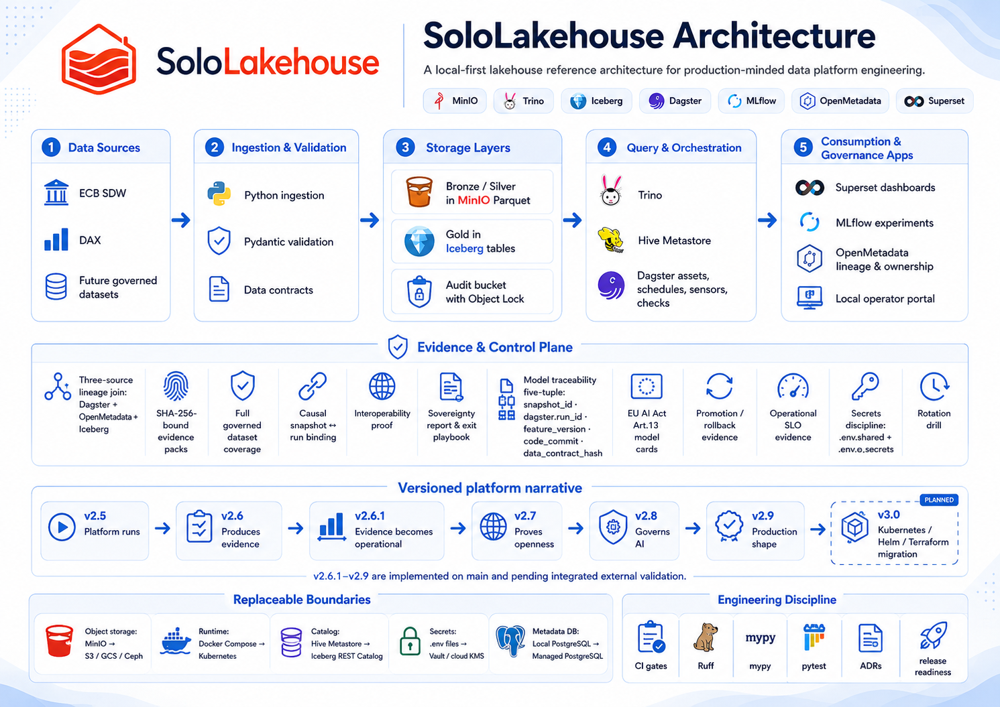
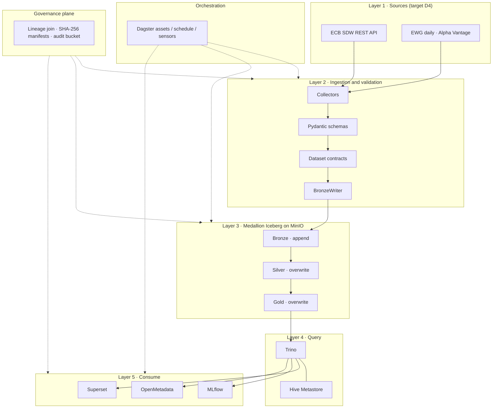

# SoloLakehouse — Architecture

## Overview

SoloLakehouse is a **Lakehouse reference implementation** standardized on a **single v2.5 runtime path**.
The local/reference deployment runs on one Docker Compose host with **MinIO**, **PostgreSQL**, **Hive Metastore**, **Trino**, **MLflow**, **Dagster**, **OpenMetadata**, and **Superset**.

The active architecture centers on five data/runtime layers (sources -> ingestion -> medallion storage -> query -> ML) plus platform services for orchestration, metadata, and BI access.
Earlier version milestones and migration narratives are preserved in **[history/README.md](history/README.md)**.

SoloLakehouse is an **upstream template** with a built-in **finance reference
pipeline** (ECB + German-equity proxy via EWG after `L4` Phase 1; legacy
`dax_*` names until then). Product instances — for example FinLakehouse or
Aviation Lakehouse — are created by cloning the template and applying the
entity contract at deploy time; **domain-specific pipeline changes belong in the
entity clone**, not in the shared upstream repository. See
[entity-template-readiness.md](entity-template-readiness.md) and the
[FinLakehouse deployment guide](finlakehouse-deployment-guide.md).

For product instances derived from the v2.5 template, use the
**[Product Entity Contract](product-entity-contract.md)** to separate stable
entity identity from physical runtime and storage details. That contract covers
**deploy-time** isolation (identity, buckets, warehouse URI, service labels) —
it does **not** replace collectors, transforms, or governed dataset contracts.
Use **[Object Store Abstraction and MinIO Deferral](object-store-abstraction.md)**
for the current MinIO provider boundary and future storage replacement path.

## Diagram — current (v2.5 runtime + v2.6–v2.9 evidence plane)



*Image source: `docs/img/slh_architecture_v2.9_a.png`.*

The diagram shows the protected **v2.5 Compose runtime** (ingestion → all-layer
Iceberg medallion → Trino / Dagster → Superset / MLflow / OpenMetadata) plus the
**evidence and control plane** delivered on `main` through v2.9: lineage audit
packs, openness proofs, AI/ML governance, promotion/SLO evidence, and secrets
discipline. Earlier v2.5-only diagrams remain under `docs/img/` as archives.

## Layers (core)

```
Layer 1 — Data Sources (target, D4): ECB SDW REST API + live EWG (Alpha Vantage)
    │                              (legacy: DAX sample CSV until L4 — retired, not optional)
    ▼
Layer 2 — Ingestion & Validation: Python collectors + Pydantic + dataset contracts + structlog
    │
    ▼
Layer 3 — Lakehouse storage (Medallion): MinIO warehouse; **Bronze / Silver / Gold**
         as Apache Iceberg via pyiceberg (ADR-020 supersedes Parquet+Hive staging)
    │
    ▼
Layer 4 — Compute & Query: Trino ↔ Hive Metastore catalog ↔ PostgreSQL
         (REST / Polaris path selectable — ADR-017; not in the default stack)
    │
    ▼
Layer 5 — ML + apps: MLflow, Superset, OpenMetadata, local operator portal
```



The **input edge** is Layer 1 plus Layer 2. Block `L` / D4 (`TASKS.md` `L4`)
implements Layer 1 remediation: ECB in place; **DAX sample CSV retired**; live
EWG replaces the market leg. `data/sample/dax_daily_sample.csv` is not an
approved option — agents must not propose keeping it. Source-selection criteria:
**[layer1-source-selection-criteria.md](layer1-source-selection-criteria.md)**.

On top of those layers, the governance plane emits SHA-256-bound evidence
(lineage, promotion, operations, secrets, K8s readiness, policy hooks) into the
audit bucket (Object Lock for fresh deployments).

## Orchestration Layer (v2)

v2 introduces Dagster as the default orchestrator for asset-aware execution, retries, scheduling, and lineage.

### Dagster assets

**Target after `L4` Phase 1:** `ecb_bronze`, `german_equity_proxy_bronze`,
`ecb_silver`, `german_equity_proxy_silver`, `ecb_german_equity_proxy_features`,
`ml_experiment`.

**On `main` today (implementation lag):** `dax_bronze`, `dax_silver`,
`gold_features` — same graph shape, legacy names and DAX sample CSV market leg.

### Asset dependency graph (ASCII)

```text
ecb_bronze      dax_bronze
    |               |
ecb_silver      dax_silver
      \           /
       \         /
        gold_features
              |
         ml_experiment
```

### Scheduling and automation

- Job: `demo_data_flow_job` (Demo acceptance path: Bronze -> Silver -> Gold)
- Job: `full_pipeline_job` (full path: Demo data-flow assets + `ml_experiment`)
- Schedule: `daily_pipeline_schedule`
- Cron: `0 6 * * 1-5` (06:00 UTC, weekdays)
- Sensor: `ecb_data_freshness_sensor` checks ECB freshness every 30 minutes and can trigger `ecb_bronze` when stale.

### Runtime model

- `dagster-webserver` provides UI and job execution entrypoint on port `3000`.
- `dagster-daemon` evaluates schedules/sensors and launches runs.
- Dagster instance storage uses PostgreSQL database `dagster_storage` for persisted run and event history.

## Components (current local/reference stack)

| Component | Role | Port |
|-----------|------|------|
| **MinIO** | S3-compatible warehouse, MLflow artifacts, and Object-Lock audit bucket | 9000 (API), 9001 (Console) |
| **PostgreSQL** | Backend for Hive Metastore and MLflow | 5432 |
| **Hive Metastore** | Table metadata (schema, partitions, locations) | 9083 |
| **Trino** | SQL over the lakehouse (Hive + Iceberg catalogs, shared Hive Metastore) | 8080 |
| **OpenMetadata** | Data catalog UI; Trino metadata ingestion | 8585 |
| **Elasticsearch** | Search backend for OpenMetadata | 9200 |
| **OpenMetadata MySQL** | Application database for OpenMetadata | 3307 (host) |
| **Apache Superset** | BI / SQL UI over Trino; dashboards and chart exploration | 8088 |
| **MLflow** | Experiments and model artifacts | 5000 |
| **Dagster Webserver** | Orchestration UI + run entrypoint | 3000 |
| **Dagster Daemon** | Schedules/sensors evaluator and run launcher | N/A (internal) |

### Persistence (local Compose)

MinIO blobs, PostgreSQL cluster files, Dagster local storage, OpenMetadata MySQL, and OpenMetadata Elasticsearch data are bind-mounted from **`docker/data/`** under the repository (see `scripts/prepare-docker-data-dirs.sh` and `docs/deployment.md`). They are not stored in Docker Engine named volumes for this stack.

## Service dependencies

```
postgres ──► hive-metastore ──► trino
postgres ──► mlflow
postgres ──► dagster-webserver
postgres ──► dagster-daemon
postgres ──► superset
om-mysql  ──► openmetadata-server
om-elasticsearch ──► openmetadata-server
minio    ──► trino
minio    ──► mlflow
minio    ──► ingestion (Bronze writes)
minio    ──► dagster assets runtime
hive-metastore ──► trino
trino    ──► superset
trino    ──► openmetadata-server
dagster-daemon ──► dagster-webserver (automation and run control)
```

## Medallion (summary)

- **Bronze:** Raw, immutable, partitioned by `ingestion_date`; metadata columns `_ingestion_timestamp`, `_source`.
- **Silver:** Cleaned types, deduplicated, derived fields (e.g. `rate_change_bps`, `daily_return`).
- **Gold:** ML-ready features (e.g. one row per ECB event for the demo model).

Details: **[medallion-model.md](medallion-model.md)**.

## Historical evolution

The Compose **runtime** stays on the v2.5 baseline until v3.0; v2.6–v2.9 add
evidence categories without changing that runtime. Earlier v1/v2 build-out
stages and migration decisions remain available as narrative context under:

- [history/timeline.md](history/timeline.md)
- [history/architecture-evolution.md](history/architecture-evolution.md)
- [history/legacy-overview.md](history/legacy-overview.md)

## Design decisions (ADRs)

See [decisions/README.md](decisions/README.md) for the ADR index. Key records
for the current diagram include ADR-017 (catalog boundary), ADR-018 (ML
five-tuple), ADR-020 (all-layer Iceberg), ADR-022 (promotion/operations), and
ADR-023 (secrets / K8s readiness).

| ADR | Topic |
|-----|--------|
| [ADR-001](decisions/ADR-001-docker-compose.md) | Docker Compose vs Kubernetes |
| [ADR-002](decisions/ADR-002-trino-vs-duckdb.md) | Trino vs DuckDB |
| [ADR-003](decisions/ADR-003-parquet-vs-delta.md) | Parquet vs Delta Lake |
| [ADR-004](decisions/ADR-004-financial-dataset.md) | ECB + DAX data |
| [ADR-005](decisions/ADR-005-v1-scope.md) | Why Prometheus / Grafana / CloudBeaver ship after the five-service core |
| [ADR-006](decisions/ADR-006-v2-dagster-orchestration.md) | v2 Dagster orchestration migration and transition fallback (historical) |
| [ADR-007](decisions/ADR-007-v3-k8s-helm-terraform.md) | v3 Kubernetes + Helm + Terraform baseline |
| [ADR-008](decisions/ADR-008-v3-environment-promotion.md) | v3 environment promotion gates |
| [ADR-009](decisions/ADR-009-v3-secrets-and-access-governance.md) | v3 secrets and access governance |
| [ADR-010](decisions/ADR-010-v3-observability-and-slo.md) | v3 SLO-driven observability |
| [ADR-011](decisions/ADR-011-v3-ml-productization-boundary.md) | v3 ML productization boundary |
| [ADR-012](decisions/ADR-012-v3-data-governance-catalog-strategy.md) | v3 data governance catalog strategy |
| [ADR-013](decisions/ADR-013-iceberg-gold-trino.md) | Iceberg for Gold via Trino |
| [ADR-014](decisions/ADR-014-openmetadata-optional-profile.md) | OpenMetadata optional compose profile at introduction time (historical) |
| [ADR-015](decisions/ADR-015-v3-observability-tooling.md) | v3 observability tooling: Prometheus + Grafana + Alertmanager |
| [ADR-016](decisions/ADR-016-compute-engine-migration.md) | Compute engine migration to Spark + dbt-spark with Trino as query-only (proposed) |
| [ADR-017](decisions/ADR-017-iceberg-rest-catalog-option.md) | Hive Metastore vs Iceberg REST Catalog vs AWS Glue (v2.7 placeholder) |
| [ADR-018](decisions/ADR-018-ml-lineage-five-tuple.md) | ML lineage five-tuple for governed MLflow runs (v2.8 E1) |
| [ADR-019](decisions/ADR-019-minio-seaweedfs-deferral.md) | MinIO to SeaweedFS migration deferral |
