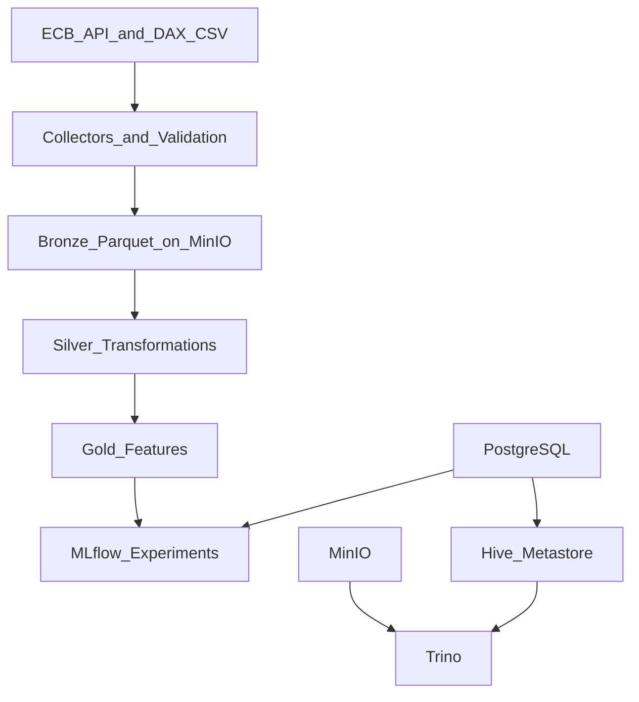

# 02 整体架构与八层目标

## v1 实际落地：五层核心

1. 数据源：ECB API + DAX 样本 CSV  
2. 采集验证：Python collectors + Pydantic + structlog  
3. 存储：MinIO + Parquet + Bronze/Silver/Gold  
4. 查询：Trino + Hive Metastore + PostgreSQL  
5. 机器学习：MLflow（跟踪+artifact）

## v1 目标语义：八层企业形态

文档里提到 v1 对齐八层企业架构目标，含 metadata/observability/user access 等能力方向。面试时应说明：**v1 当前是“核心闭环已落地 + 目标层次已定义”**。

## 服务依赖关系

## 为什么这套组合有代表性

- MinIO 模拟对象存储，成本低、可本地复现。
- Hive Metastore + Trino 展示了“元数据 + 计算引擎”的典型 Lakehouse 组合。
- MLflow 将“数据平台”与“实验平台”贯通，体现平台工程横向能力。

## 面试追问：为什么不用全托管云服务

- 这是参考实现，优先“可读性、可复现、可演示”。
- 单机模式更适合教学、PoC、面试展示。
- 路线图已预留 v3 向云原生与 IaC 的迁移路径。

## 关键架构口径

- **架构分层**：关注职责边界，不把采集、计算、服务编排揉成一团。
- **数据不可变**：Bronze 按分区追加，避免原地覆盖导致追溯困难。
- **质量前置**：在采集/转换早阶段失败，减少下游隐性污染。
- **工程闭环**：部署、验证、测试、发布、演进文档齐全。
