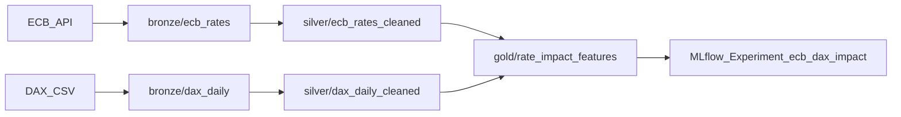

# 04 数据流与 Medallion 详解

## 全链路路径

## Bronze 层

- 特征：原始数据、追加写入、按 `ingestion_date` 分区、不可变。
- 目的：保留可追溯原始状态，方便重放与审计。
- 关键实现：`BronzeWriter.write()` 和 `write_rejected()`。

## Silver 层

- ECB：类型清洗、排序、前向填充、生成 `rate_change_bps`。
- DAX：过滤周末、计算 `daily_return`、去重。
- 特点：可消费的规范化数据，降低下游复杂度。

## Gold 层

- 以 ECB 利率变动事件为中心构建样本。
- 与 DAX 交易日对齐，提取事件前后收益与波动特征。
- 输出模型训练所需统一特征集。
- **v2.5**：Gold 仍落地为 Parquet 路径 `gold/rate_impact_features/`，并由 Trino 同步注册为 **Iceberg** 表 `iceberg.gold.ecb_dax_features`（Hive 作 staging 外部表后 CTAS）；便于演示开放表格式与快照语义。

## rejected records（死信）

- 校验失败记录进入 `bronze/rejected/source=.../`。
- 每条包含 `rejection_reason`，支持根因分析。
- 面试价值：体现“平台并非静默丢数据”。

## 质量控制策略

- 未来日期检查、日期连续性检查、schema 缺失检查。
- 原则：早失败、可解释、可定位。

## 面试关键词

- Data lineage（数据血缘）
- Immutable raw zone（不可变原始层）
- Progressive data contracts（逐层收敛的数据契约）
- Failure isolation（失败隔离：坏数据进 rejected，不污染主路径）
